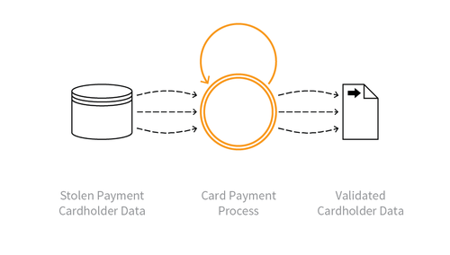

---

layout: col-sidebar
title: OAT-001 Carding
site_side: false
tags: oatsJA
project: true

---

**カード試行 (Carding)** は自動化された脅威です。 OWASP Automated Threat Handbook - Web Applications ([pdf](https://github.com/OWASP/www-project-automated-threats-to-web-applications/tree/master/assets/files/EN), [印刷物](http://www.lulu.com/shop/owasp-foundation/automated-threat-handbook/paperback/product-23540699.html)) は [OWASP Automated Threats to Web Applications Project](../../../) の成果物であり、それぞれの脅威、検出方法、対策についてより詳しいガイドを提供します。 [脅威識別チャート](https://www.owasp.org/www-project-automated-threats-to-web-applications/assets/files/oat-ontology-decision-chart.pdf) は自動化された脅威を正しく識別するのに役立ちます。

## 定義
### OWASP Automated Threat (OAT) ID 番号
OAT-001

### 脅威イベント名
カード試行 (Carding)

### 特徴・特性の概要
複数回の支払い承認を試行して、盗まれた大量のペイメントカードデータの有効性を検証します。

### イメージ図

### 解説
大量のクレジットカードやデビットカードのデータリストを加盟店の支払いプロセスに対してテストし、有効なカード情報を識別します。多くの場合、盗まれたデータの品質は不明であり、カード試行を使用して、より価値の高い良質なデータを識別します。ペイメントカード所有者データは別のアプリケーションから盗まれたか、別の支払いチャネルから盗まれたか、犯罪市場から取得された可能性があります。

カード所有者データの一部が利用可能で、有効期限やセキュリティコードが不明な場合、このプロセスは [OAT-010 カードクラッキング (Card Cracking)](OAT-010_Card_Cracking.md) と呼ばれます。盗まれたカードを使用して現金や商品を手に入れることは [OAT-012 現金引き出し (Cashing Out)](OAT-012_Cashing_Out.md) といいます。

### 他の名称や事例
カードスタッフィング (Card stuffing); クレジットカードスタッフィング (Credit card stuffing); カード検証 (Card verification)

### 関連項目
* [OAT-010 カードクラッキング (Card Cracking)](OAT-010_Card_Cracking.md)
* [OAT-012 現金引き出し (Cashing Out)](OAT-012_Cashing_Out.md)

## クロスリファレンス
### CAPEC Category / Attack Pattern IDs
* 210 Abuse of Functionality

### CWE Base / Class / Variant IDs
* 799 Improper Control of Interaction Frequency
* 837 Improper Enforcement of a Single, Unique Action

### WASC Threat IDs
* 21 Insufficient Anti-Automation
* 42 Abuse of Functionality

### OWASP Attack Category / Attack IDs
* Abuse of Functionality

  [OWASP ウェブアプリケーションに対する自動化された脅威プロジェクト](../../../) に戻る。  
