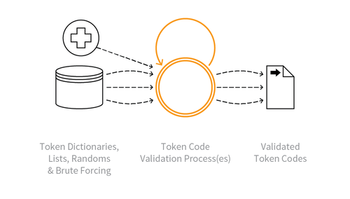

---

layout: col-sidebar
title: OAT-002 Token Cracking
site_side: false
tags: oatsJA
project: true

---

**トークンクラッキング (Token Cracking)** は自動化された脅威です。 OWASP Automated Threat Handbook - Web Applications ([pdf](https://github.com/OWASP/www-project-automated-threats-to-web-applications/tree/master/assets/files/EN), [印刷物](http://www.lulu.com/shop/owasp-foundation/automated-threat-handbook/paperback/product-23540699.html)) は [OWASP Automated Threats to Web Applications Project](../../../) の成果物であり、それぞれの脅威、検出方法、対策についてより詳しいガイドを提供します。 [脅威識別チャート](https://www.owasp.org/www-project-automated-threats-to-web-applications/assets/files/oat-ontology-decision-chart.pdf) は自動化された脅威を正しく識別するのに役立ちます。

## 定義
### OWASP Automated Threat (OAT) ID 番号
OAT-002

### 脅威イベント名
トークンクラッキング (Token Cracking)

### 特徴・特性の概要
クーポン番号、バウチャーコード、割引トークンなどを大量列挙します。

### イメージ図

### 解説
アプリケーション内でユーザーになんらかの形式の特典を提供する有効なトークンコードを識別します。特典には現金相当品、現金以外のクレジット、割引、限定オファーへのアクセスなどの機会、などがあります。

ユーザー名のクラッキングについては [OAT-007 認証情報クラッキング (Credential Cracking)](OAT-007_Credential_Cracking.md) を参照してください。

### 他の名称や事例
クーポン推測 (Coupon guessing); バウチャー、ギフトカード、割引の列挙

### 関連項目
* [OAT-007 認証情報クラッキング (Credential Cracking)](OAT-007_Credential_Cracking.md)
* [OAT-011 スクレイピング (Scraping)](OAT-011_Scraping.md)
* [OAT-012 現金引き出し (Cashing Out)](OAT-012_Cashing_Out.md)

## クロスリファレンス
### CAPEC Category / Attack Pattern IDs
* 112 Brute Force
* 210 Abuse of Functionality

### CWE Base / Class / Variant IDs
* 799 Improper Control of Interaction Frequency
* 837 Improper Enforcement of a Single, Unique Action

### WASC Threat IDs
* 11 Brute Force
* 21 Insfficient Anti-Automation
* 42 Abuse of Functionality

### OWASP Attack Category / Attack IDs
* Abuse of Functionality
* Brute Force Attack

  [OWASP ウェブアプリケーションに対する自動化された脅威プロジェクト](../../../) に戻る。  
