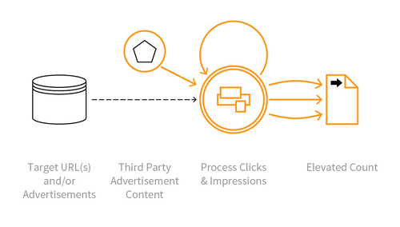

---

layout: col-sidebar
title: OAT-003 Ad Fraud
site_side: false
tags: oatsJA
project: true

---

**広告詐欺 (Ad Fraud)** は自動化された脅威です。 OWASP Automated Threat Handbook - Web Applications ([pdf](https://github.com/OWASP/www-project-automated-threats-to-web-applications/tree/master/assets/files/EN), [印刷物](http://www.lulu.com/shop/owasp-foundation/automated-threat-handbook/paperback/product-23540699.html)) は [OWASP Automated Threats to Web Applications Project](../../../) の成果物であり、それぞれの脅威、検出方法、対策についてより詳しいガイドを提供します。 [脅威識別チャート](https://www.owasp.org/www-project-automated-threats-to-web-applications/assets/files/oat-ontology-decision-chart.pdf) は自動化された脅威を正しく識別するのに役立ちます。

## 定義
### OWASP Automated Threat (OAT) ID 番号
OAT-0003

### 脅威イベント名
広告偽装 (Ad Fraud)

### 特徴・特性の概要
ウェブ掲載広告の偽装クリックや偽装表示です。

### イメージ図

### 解説
広告などのアイテムがクリックされた回数や広告が表示された回数を偽装します。広告を表示するウェブサイトの所有者、競合他社、荒らし行為によって行われます。

ウェブ掲載広告を伴わない同様の活動については [OAT-016 スキューイング (Skewing)](OAT-016_Skewing.md) を参照してください。

### 他の名称や事例
広告偽装 (Advert fraud); アドウェアトラフィック (Adware traffic); クリックボット (Click bot); クリック偽装 (Click fraud); ヒット偽装 (Hit fraud); インプレッション偽装 (Impression fraud); クリック課金型広告の不正使用 (Pay per click advertising abuse); 偽装広告トラフィック (Phoney ad traffic)

### 関連項目
* [OAT-016 スキューイング (Skewing)](OAT-016_Skewing.md)

## クロスリファレンス
### CAPEC Category / Attack Pattern IDs
* 210 Abuse of Functionality

### CWE Base / Class / Variant IDs
* -

### WASC Threat IDs
* 21 Insufficient Anti-Automation
* 42 Abuse of Functionality

### OWASP Attack Category / Attack IDs
* Abuse of Functionality

  [OWASP ウェブアプリケーションに対する自動化された脅威プロジェクト](../../../) に戻る。  
