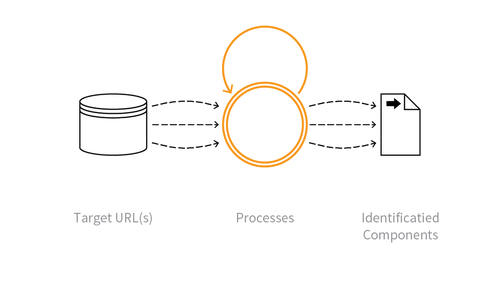

---

layout: col-sidebar
title: OAT-004 Fingerprinting
site_side: false
tags: oatsJA
project: true

---

**指紋採取 (Fingerprinting)** は自動化された脅威です。 OWASP Automated Threat Handbook - Web Applications ([pdf](https://github.com/OWASP/www-project-automated-threats-to-web-applications/tree/master/assets/files/EN), [印刷物](http://www.lulu.com/shop/owasp-foundation/automated-threat-handbook/paperback/product-23540699.html)) は [OWASP Automated Threats to Web Applications Project](../../../) の成果物であり、それぞれの脅威、検出方法、対策についてより詳しいガイドを提供します。 [脅威識別チャート](https://www.owasp.org/www-project-automated-threats-to-web-applications/assets/files/oat-ontology-decision-chart.pdf) は自動化された脅威を正しく識別するのに役立ちます。

## 定義
### OWASP Automated Threat (OAT) ID 番号
OAT-004

### 脅威イベント名
指紋採取 (Fingerprinting)

### 特徴・特性の概要
サポートしているソフトウェアとフレームワークのタイプとバージョンに関する情報を引き出します。

### イメージ図

### 解説
特定のリクエストをアプリケーションに送信し、情報を引き出し、アプリケーションをプロファイルします。この調査は一般的に HTTP ヘッダの名前と値、セッション識別子の名前と形式、エラーページメッセージの内容、URL パスの大文字と小文字の区別、URL パスパターン、ファイル拡張子、ソフトウェア固有のファイルやディレクトリが存在するかどうかを調べます。指紋採取は情報漏洩に関与していることが多く、このプロファイリングによってネットワークアーキテクチャやトポロジーが明らかになることもあります。指紋採取はアプリケーションを直接使用することなく実行できることがあります。たとえば、検索エンジンのインデックスに保持されているような公開されているアプリケーションプロパティのストアにクエリします。

指紋採取はアプリケーションコンポーネントを識別しようとするものです。一方で [OAT-018 足跡採取 (Footprinting)](OAT-018_Footprinting.md) はアプリケーションがどのように動作するかをより詳細に分析します。

### 他の名称や事例
グーグルドーキング (Google dorking); グーグルハッキング (Google hacking); ショーダニング (Shodaning); ターゲット獲得 (Target acquisition); ターゲットスキャン (Target scanning); 潜在的に脆弱なアプリケーションの発見 (Finding potentially vulnerable applications); 偵察 (Reconnaissance); URL 収集 (URL harvesting); ウェブアプリケーション指紋採取 (Web application fingerprinting)

### 関連項目
* [OAT-011 スクレイピング (Scraping)](OAT-011_Scraping.md)
* [OAT-018 足跡採取 (Footprinting)](OAT-018_Footprinting.md)

## クロスリファレンス
### CAPEC Category / Attack Pattern IDs
* 541 Application Fingerprinting
* 170 Web Application Fingerprinting

### CWE Base / Class / Variant IDs
* 200 Information Exposure

### WASC Threat IDs
* 45 Fingerprinting

### OWASP Attack Category / Attack IDs
* -

  [OWASP ウェブアプリケーションに対する自動化された脅威プロジェクト](../../../) に戻る。  
