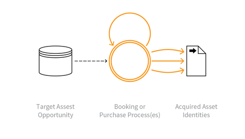

---

layout: col-sidebar
title: OAT-005 Scalping
site_side: false
tags: oatsJA
project: true

---

**スキャルピング (Scalping)** は自動化された脅威です。 OWASP Automated Threat Handbook - Web Applications ([pdf](https://github.com/OWASP/www-project-automated-threats-to-web-applications/tree/master/assets/files/EN), [印刷物](http://www.lulu.com/shop/owasp-foundation/automated-threat-handbook/paperback/product-23540699.html)) は [OWASP Automated Threats to Web Applications Project](../../../) の成果物であり、それぞれの脅威、検出方法、対策についてより詳しいガイドを提供します。 [脅威識別チャート](https://www.owasp.org/www-project-automated-threats-to-web-applications/assets/files/oat-ontology-decision-chart.pdf) は自動化された脅威を正しく識別するのに役立ちます。

## 定義
### OWASP Automated Threat (OAT) ID 番号
OAT-005

### 脅威イベント名
スキャルピング (Scalping)

### 特徴・特性の概要
入手が困難であったり優先的である商品やサービスを不当な手段で取得します。

### イメージ図

### 解説
通常のユーザーが手動で実行できない方法で、アプリケーションを使用して商品やサービスを取得します。

スキャルピングは商品やサービスの入手待ちを監視したり、通常のユーザーを打ち負かしてそれらを取得するための迅速なアクションなどがありますが、スキャルピングは [OAT-013 狙撃 (Sniping)](OAT-013_Sniping.md) のような「直前」でのアクションではありませんし、 [OAT-006 高速化 (Expediting)](OAT-006_Expediting.md) のようなユーザーのための自動化に関するものだけでもありません。スキャルピングには人気のある商品やサービスの入手困難性という追加の概念があり、取得したチケットを後で転売して利益を得る転売屋やダフ屋によるチケットビジネスがもっともよく知られています。また、商品やサービスが急激に利用できなくなるため、一種のユーザーサービス拒否につながる可能性もあります。

### 他の名称や事例
一括購入 (Bulk purchase); 購入オートマトン (Purchase automaton); 購入ボット (Purchase bot); レストランのテーブルやホテルの部屋の高速予約; キュージャンピング (Queue jumping); セールスタンピード (Sale stampede); 二次チケット販売 (Secondary ticketing); チケット転売 (Ticket resale); チケットスキャルピング (Ticket scalping); チケットダフ屋行為 (Ticket touting)

### 関連項目
* [OAT-006 高速化 (Expediting)](OAT-006_Expediting.md)
* [OAT-013 狙撃 (Sniping)](OAT-013_Sniping.md)
* [OAT-015 サービス拒否 (Denial of Service)](OAT-015_Denial_of_Service.md)
* [OAT-021 在庫拒否 (Denial of Inventory)](OAT-021_Denial_of_Inventory.md)

## クロスリファレンス
### CAPEC Category / Attack Pattern IDs
* 210 Abuse of Functionality

### CWE Base / Class / Variant IDs
* 799 Improper Control of Interaction Frequency
* 837 Improper Enforcement of a Single, Unique Action

### WASC Threat IDs
* 21 Insufficient Anti-Automation
* 42 Abuse of Functionality

### OWASP Attack Category / Attack IDs
* Abuse of Functionality

  [OWASP ウェブアプリケーションに対する自動化された脅威プロジェクト](../../../) に戻る。  
