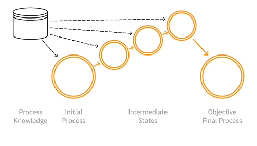

---

layout: col-sidebar
title: OAT-006 Expediting
site_side: false
tags: oatsJA
project: true

---

**高速化 (Expediting)** は自動化された脅威です。 OWASP Automated Threat Handbook - Web Applications ([pdf](https://github.com/OWASP/www-project-automated-threats-to-web-applications/tree/master/assets/files/EN), [印刷物](http://www.lulu.com/shop/owasp-foundation/automated-threat-handbook/paperback/product-23540699.html)) は [OWASP Automated Threats to Web Applications Project](../../../) の成果物であり、それぞれの脅威、検出方法、対策についてより詳しいガイドを提供します。 [脅威識別チャート](https://www.owasp.org/www-project-automated-threats-to-web-applications/assets/files/oat-ontology-decision-chart.pdf) は自動化された脅威を正しく識別するのに役立ちます。

## 定義
### OWASP Automated Threat (OAT) ID 番号
OAT-006

### 脅威イベント名
高速化 (Expediting)

### 特徴・特性の概要
一般的に遅く、退屈で、時間のかかるアクションの進行を速めるアクションを実行します。

### イメージ図

### 解説
アプリケーションの通常の使用に関する明示的または暗黙的な仮定に違反した速度を使用して、不当な個人的利益を獲得します。多くの場合、他者への詐欺や損失を伴います。

メトリクスに影響を与える [OAT-016 スキューイング (Skewing)](OAT-016_Skewing.md) とは対照的に、高速化は純粋に一連のアプリケーションプロセスの進行をより速くすることだけに関連しています。また [OAT-017 スパム行為 (Spamming)](OAT-017_Spamming.md) は高速化とは異なります。スパムの焦点は情報を追加することであり、プロセス進行の概念を伴わない可能性があります。

### 他の名称や事例
アルゴリズム取引 (Algorithmic trading); 自動株式取引 (Automated stock trading); 賭けの自動化 (Betting automation); ゲームの自動化 (Game automation); ゲーミングボット (Gaming bot); ゴールドファーミング (Gold farming); 金融商品取引 (Financial instrument dealing); 高頻度取引 (High frequency trading); ラストルック取引 (Last look trade); マイニング (Mining); 購入の自動化 (Purchase automation); チケット購入の自動化 (Ticketing automation); 取引の自動化 (Trading automation); 仮想資産生成ボット (Virtual wealth generation bot)

### 関連項目
* [OAT-005 スキャルピング (Scalping)](OAT-005_Scalping.md)
* [OAT-013 狙撃 (Sniping)](OAT-013_Sniping.md)
* [OAT-016 スキューイング (Skewing)](OAT-016_Skewing.md)
* [OAT-017 スパム行為 (Spamming)](OAT-017_Spamming.md)

## クロスリファレンス
### CAPEC Category / Attack Pattern IDs
* 210 Abuse of Functionality

### CWE Base / Class / Variant IDs
* 841 Improper Enforcement of Behavioral Workflow

### WASC Threat IDs
* 21 Insufficient Anti-Automation
* 42 Abuse of Functionality

### OWASP Attack Category / Attack IDs
* Abuse of Functionality

  [OWASP ウェブアプリケーションに対する自動化された脅威プロジェクト](../../../) に戻る。  
