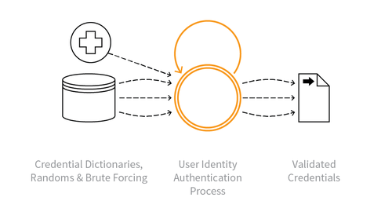

---

layout: col-sidebar
title: OAT-007 Credential Cracking
site_side: false
tags: oatsJA
project: true

---

**認証情報クラッキング (Credential Cracking)** は自動化された脅威です。 OWASP Automated Threat Handbook - Web Applications ([pdf](https://github.com/OWASP/www-project-automated-threats-to-web-applications/tree/master/assets/files/EN), [印刷物](http://www.lulu.com/shop/owasp-foundation/automated-threat-handbook/paperback/product-23540699.html)) は [OWASP Automated Threats to Web Applications Project](../../../) の成果物であり、それぞれの脅威、検出方法、対策についてより詳しいガイドを提供します。 [脅威識別チャート](https://www.owasp.org/www-project-automated-threats-to-web-applications/assets/files/oat-ontology-decision-chart.pdf) は自動化された脅威を正しく識別するのに役立ちます。

## 定義
### OWASP Automated Threat (OAT) ID 番号
OAT-007

### 脅威イベント名
認証情報クラッキング (Credential Cracking)

### 特徴・特性の概要
ユーザー名やパスワードにさまざまな値を試すことで、有効なログイン認証情報を特定します。

### イメージ図

### 解説
ブルートフォース攻撃、辞書 (単語リスト) 攻撃、推測攻撃をアプリケーションの認証プロセスに使用して、有効なアカウント認証情報を特定します。これには一般的なユーザー名やパスワードを利用したり、初期ユーザー名の評価に関連することがあります。

盗まれた認証情報セット (ユーザー名とパスワードのペア) を使用して、一つ以上のサービスで認証を行うことは [OAT-008 認証情報スタッフィング (Credential Stuffing)](OAT-008_Credential_Stuffing.md) になります。

### 他の名称や事例
サインインに対するブルートフォース攻撃 (Brute-force attacks against sign-in); ログイン認証情報のブルートフォース (Brute forcing log-in credentials); ブルートフォースパスワードクラッキング (Brute-force password cracking); ログイン認証情報のクラッキング (Cracking login credentials); パスワードブルートフォース (Password brute-forcing); パスワードクラッキング (Password cracking); リバースブルートフォース攻撃 (Reverse brute force attack); ユーザー名クラッキング (Username cracking); ユーザー名列挙 (Username enumeration)

### 関連項目
* [OAT-002 トークンクラッキング (Token Cracking)](OAT-002_Token_Cracking.html)
* [OAT-008 認証情報スタッフィング (Credential Stuffing)](OAT-008_Credential_Stuffing.html)
* [OAT-019 アカウント作成 (Account Creation)](OAT-019_Account_Creation.html)

## クロスリファレンス
### CAPEC Category / Attack Pattern IDs
* 16 Dictionary-based Password Attack
* 49 Password Brute Forcing
* 70 Try Common(default) Usernames and Passwords
* 112 Brute Force

### CWE Base / Class / Variant IDs
* 307 Improper Restriction of Excessive Authentication Attempts
* 799 Improper Control of Interaction Frequency
* 837 Improper Enforcement of a Single, Unique Action

### WASC Threat IDs
* 11 Brute Force
* 21 Insufficient Anti-Automation
* 42 Abuse of Functionality

### OWASP Attack Category / Attack IDs
* Abuse of Functionality
* Brute Force Attack

  [OWASP ウェブアプリケーションに対する自動化された脅威プロジェクト](../../../) に戻る。  
