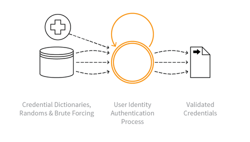

---

layout: col-sidebar
title: OAT-007 Credential Cracking
site_side: false
tags: oatsJA
project: true

---

**認証情報クラッキング (Credential Cracking)** は自動化された脅威です。 OWASP Automated Threat Handbook - Web Applications ([pdf](https://github.com/OWASP/www-project-automated-threats-to-web-applications/tree/master/assets/files/EN), [印刷物](https://www.lulu.com/shop/colin-watson-and-tin-zaw/owasp-automated-threat-handbook/paperback/product-w4wj7qq.html)) は [OWASP Automated Threats to Web Applications Project](../../../) の成果物であり、それぞれの脅威、検出方法、対策についてより詳しいガイドを提供します。 [脅威識別チャート](https://www.owasp.org/www-project-automated-threats-to-web-applications/assets/files/oat-ontology-decision-chart.pdf) は自動化された脅威を正しく識別するのに役立ちます。

## 定義
### OWASP Automated Threat (OAT) ID 番号
OAT-007

### 脅威イベント名
認証情報クラッキング (Credential Cracking)

### 特徴・特性の概要
ユーザー名やパスワードにさまざまな値を試すことで、有効なログイン認証情報を特定します。

### イメージ図

### 解説
ブルートフォース攻撃、辞書 (単語リスト) 攻撃、推測攻撃をアプリケーションの認証プロセスに使用して、有効なアカウント認証情報を特定します。これには一般的なユーザー名やパスワードを利用したり、初期ユーザー名の評価に関連することがあります。ユーザー名が電子メールアドレスであるウェブサイトで、電子メールサブスクリプションに登録するために電子メールアドレスのリストを試すなど、必ずしも直接認証とはみなされない機能を悪用する可能性があります。

盗まれた認証情報セット (ユーザー名とパスワードのペア) を使用して、一つ以上のサービスで認証を行うことは [OAT-008 認証情報スタッフィング (Credential Stuffing)](OAT-008_Credential_Stuffing.md) になります。他の場所で使用するためにユーザー (電子メールアドレスなど) を特定するためだけのプロセスを使用することは [OAT-011 スクレイピング (Scraping)](OAT-011_Scraping.md) になります。

### 他の名称や事例
ログイン認証情報のブルートフォース (Brute forcing log-in credentials); ブルートフォースパスワードクラッキング (Brute-force password cracking); ログイン認証情報のクラッキング (Cracking login credentials); メーリングリストスタッフィング (Mailing list stuffing); パスワードブルートフォース (Password brute-forcing); パスワードクラッキング (Password cracking); パスワードスプレー (Password spraying); リバースブルートフォース攻撃 (Reverse brute force attack); ユーザー名クラッキング (Username cracking); ユーザー名列挙 (Username enumeration)

### 関連項目
* [OAT-002 トークンクラッキング (Token Cracking)](OAT-002_Token_Cracking.md)
* [OAT-008 認証情報スタッフィング (Credential Stuffing)](OAT-008_Credential_Stuffing.md)
* [OAT-019 アカウント作成 (Account Creation)](OAT-019_Account_Creation.md)
* [OAT-020 アカウント集約 (Account Aggregation)](OAT-020_Account_Aggregation.md)

## クロスリファレンス
### CAPEC Category / Attack Pattern IDs
* 16 Dictionary-based Password Attack
* 49 Password Brute Forcing
* 70 Try Common or Default Usernames and Passwords
* 112 Brute Force

### CWE Base / Class / Variant IDs
* 307 Improper Restriction of Excessive Authentication Attempts
* 799 Improper Control of Interaction Frequency
* 837 Improper Enforcement of a Single, Unique Action

### WASC Threat IDs
* 11 Brute Force
* 21 Insufficient Anti-Automation
* 42 Abuse of Functionality

### OWASP Attack Category / Attack IDs
* Brute Force Attack
* Password Spraying

  [OWASP ウェブアプリケーションに対する自動化された脅威プロジェクト](../../../) に戻る。  
