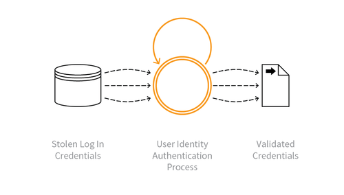

---

layout: col-sidebar
title: OAT-008 Credential Stuffing
site_side: false
tags: oatsJA
project: true

---

**認証情報スタッフィング (Credential Stuffing)** は自動化された脅威です。 OWASP Automated Threat Handbook - Web Applications ([pdf](https://github.com/OWASP/www-project-automated-threats-to-web-applications/tree/master/assets/files/EN), [印刷物](http://www.lulu.com/shop/owasp-foundation/automated-threat-handbook/paperback/product-23540699.html)) は [OWASP Automated Threats to Web Applications Project](../../../) の成果物であり、それぞれの脅威、検出方法、対策についてより詳しいガイドを提供します。 [脅威識別チャート](https://www.owasp.org/www-project-automated-threats-to-web-applications/assets/files/oat-ontology-decision-chart.pdf) は自動化された脅威を正しく識別するのに役立ちます。

## 定義
### OWASP Automated Threat (OAT) ID 番号
OAT-008

### 脅威イベント名
認証情報スタッフィング (Credential Stuffing)

### 特徴・特性の概要
大量のログインを試行して、盗まれたユーザー名とパスワードのペアの有効性を検証します。

### イメージ図

### 解説
どこからか盗まれた認証情報のリストをアプリケーションの認証メカニズムに対してテストし、ユーザーが同じログイン認証情報を再利用しているかどうかを識別します。盗まれたユーザー名 (多くの場合、電子メールアドレス) とパスワードのペアは攻撃者が別のアプリケーションから直接入手したか、犯罪市場で購入したか、一般に入手可能な侵害データダンプから入手した可能性があります。

[OAT-007 認証情報クラッキング (Credential Cracking)](OAT-007_Credential_Cracking.md) とは異なり、認証情報スタッフィングではブルートフォースや値の推測は行いません。代わりに、他のアプリケーションで使用される認証情報が有効かどうかをテストします。

### 他の名称や事例
アカウントチェッカー攻撃 (Account checker attack); アカウントチェック (Account checking); アカウントの乗っ取り (Account takeover); アカウント乗っ取り攻撃 (Account takeover attack); ログインスタッフィング (Login Stuffing); パスワードリスト攻撃 (Password list attack); パスワード再利用 (Password re-use); 盗まれた認証情報 (Stolen credentials); 盗まれた認証情報の使用 (Use of stolen credentials)

### 関連項目
* [OAT-007 認証情報クラッキング (Credential Cracking)](OAT-007_Credential_Cracking.md)
* [OAT-019 アカウント作成 (Account Creation)](OAT-019_Account_Creation.md)

## クロスリファレンス
### CAPEC Category / Attack Pattern IDs
* 210 Abuse of Functionality

### CWE Base / Class / Variant IDs
* 799 Improper Control of Interaction Frequency
* 837 Improper Enforcement of a Single, Unique Action

### WASC Threat IDs
* 21 Insufficient Anti-Automation
* 42 Abuse of Functionality

### OWASP Attack Category / Attack IDs
* Abuse of Functionality
* Credential Stuffing

  [OWASP ウェブアプリケーションに対する自動化された脅威プロジェクト](../../../) に戻る。  
