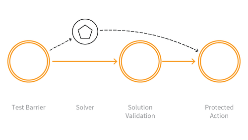

---

layout: col-sidebar
title: OAT-009 CAPTCHA Defeat
site_side: false
tags: oatsJA
project: true

---

**CAPTCHA 破り (CAPTCHA Defeat)** は自動化された脅威です。 OWASP Automated Threat Handbook - Web Applications ([pdf](https://github.com/OWASP/www-project-automated-threats-to-web-applications/tree/master/assets/files/EN), [印刷物](http://www.lulu.com/shop/owasp-foundation/automated-threat-handbook/paperback/product-23540699.html)) は [OWASP Automated Threats to Web Applications Project](../../../) の成果物であり、それぞれの脅威、検出方法、対策についてより詳しいガイドを提供します。 [脅威識別チャート](https://www.owasp.org/www-project-automated-threats-to-web-applications/assets/files/oat-ontology-decision-chart.pdf) は自動化された脅威を正しく識別するのに役立ちます。

## 定義
### OWASP Automated Threat (OAT) ID 番号
OAT-009

### 脅威イベント名
CAPTCHA 破り (CAPTCHA Defeat)

### 特徴・特性の概要
自動化防止テストを解決します。

### イメージ図

### 解説
コンピュータと人間を区別するための完全に自動化された公開チューリングテスト (Completely Automated Public Turing test to tell Computers and Humans Apart, CAPTCHA) チャレンジは通常のユーザーとボットを区別するために使用されます。視覚的や聴覚的な CAPTCHA テストや関連するパズルを分析し、答えを決定するための試行に自動化を使用します。従来の視覚的および聴覚的 CAPTCHA とは別に、パズルを解くミニゲームや算数の演習を使用することもあります。これらの中にはコンテキスト固有のチャレンジが含まれることもあります。

答えを決定するプロセスでは光学式文字認識を実行するツールを利用したり、あらかじめ生成された画像を事前準備したデータベースと照合したり、他の機械読み取りを使用したり、人力で対応します。

### 他の名称や事例
CAPTCHA 解除 (Breaking CAPTCHA; CAPTCHA breaker; CAPTCHA breaking); CAPTCHA 回避 (CAPTCHA bypass); CAPTCHA 解読 (CAPTCHA decoding); CAPTCHA ソルバー (CAPTCHA solver); CAPTCHA 解法 (CAPTCHA solving); パズル解法 (Puzzle solving)

### 関連項目
* [OAT-006 高速化 (Expediting)](OAT-006_Expediting.html)
* [OAT-011 スクレイピング (Scraping)](OAT-011_Scraping.html)

## クロスリファレンス
### CAPEC Category / Attack Pattern IDs
* -

### CWE Base / Class / Variant IDs
* 804 Guessable CAPTCHA
* 841 Improper Enforcement of Behavioral Workflow

### WASC Threat IDs
* 21 Insufficient Anti-Automation
* 42 Abuse of Functionality

### OWASP Attack Category / Attack IDs
* -

  [OWASP ウェブアプリケーションに対する自動化された脅威プロジェクト](../../../) に戻る。  
