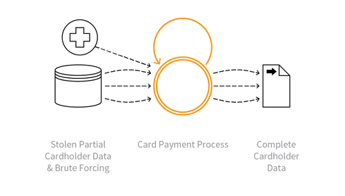

---

layout: col-sidebar
title: OAT-010 Card Cracking
site_side: false
tags: oatsJA
project: true

---

**カードクラッキング (Card Cracking)** は自動化された脅威です。 OWASP Automated Threat Handbook - Web Applications ([pdf](https://github.com/OWASP/www-project-automated-threats-to-web-applications/tree/master/assets/files/EN), [印刷物](http://www.lulu.com/shop/owasp-foundation/automated-threat-handbook/paperback/product-23540699.html)) は [OWASP Automated Threats to Web Applications Project](../../../) の成果物であり、それぞれの脅威、検出方法、対策についてより詳しいガイドを提供します。 [脅威識別チャート](https://www.owasp.org/www-project-automated-threats-to-web-applications/assets/files/oat-ontology-decision-chart.pdf) は自動化された脅威を正しく識別するのに役立ちます。

## 定義
### OWASP Automated Threat (OAT) ID 番号
OAT-010

### 脅威イベント名
カードクラッキング (Card Cracking)

### 特徴・特性の概要
盗まれたペイメントカードのデータに欠落している開始日/有効期限やセキュリティコードをさまざまな値を試して特定します。

### イメージ図

### 解説
アプリケーションペイメントカードプロセスに対してブルートフォース攻撃と行い、開始日、有効期限、カードセキュリティコード (Card Security Code) の欠落した値を特定します。カードセキュリティコード (Card Security Code) はカード確認番号2 (Card Validation Number 2, CVN2)、カード確認コード (Card Validation Code, CVC)、カード検証値 (Card Verification Value, CV2)、カード識別番号 (Card IDentification number, CID) など多くの方法で参照されます。

これらの値がプライマリアカウント番号 (Primary Account Number, PAN) と同様にわかっている場合、 [OAT-001 カード試行 (Carding)](OAT-001_Carding.md) を使用して詳細を確認し、 [OAT-012 現金引き出し (Cashing Out)](OAT-012_Cashing_Out.md) で商品や現金を手に入れます。

### 他の名称や事例
クレジットカード情報のブルートフォース (Brute forcing credit card information); カードブルートフォース (Card brute forcing); クレジットカードクラッキング (Credit card cracking); 分散推測攻撃 (Distributed guessing attack)

### 関連項目
* [OAT-001 カード試行 (Carding)](OAT-001_Carding.md)
* [OAT-012 現金引き出し (Cashing Out)](OAT-012_Cashing_Out.md)

## クロスリファレンス
### CAPEC Category / Attack Pattern IDs
* 112 Brute Force
* 210 Abuse of Functionality

### CWE Base / Class / Variant IDs
* 799 Improper Control of Interaction Frequency
* 837 Improper Enforcement of a Single, Unique Action

### WASC Threat IDs
* 11 Brute Force
* 21 Insufficient Anti-Automation
* 42 Abuse of Functionality

### OWASP Attack Category / Attack IDs
* Abuse of Functionality
* Brute Force Attack

  [OWASP ウェブアプリケーションに対する自動化された脅威プロジェクト](../../../) に戻る。  
