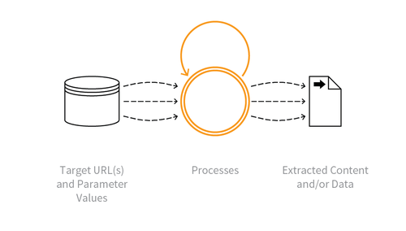

---

layout: col-sidebar
title: OAT-011 Scraping
site_side: false
tags: oatsJA
project: true

---

**スクレイピング (Scraping)** は自動化された脅威です。 OWASP Automated Threat Handbook - Web Applications ([pdf](https://github.com/OWASP/www-project-automated-threats-to-web-applications/tree/master/assets/files/EN), [印刷物](http://www.lulu.com/shop/owasp-foundation/automated-threat-handbook/paperback/product-23540699.html)) は [OWASP Automated Threats to Web Applications Project](../../../) の成果物であり、それぞれの脅威、検出方法、対策についてより詳しいガイドを提供します。 [脅威識別チャート](https://www.owasp.org/www-project-automated-threats-to-web-applications/assets/files/oat-ontology-decision-chart.pdf) は自動化された脅威を正しく識別するのに役立ちます。

## 定義
### OWASP Automated Threat (OAT) ID 番号
OAT-011

### 脅威イベント名
スクレイピング (Scraping)

### 特徴・特性の概要
アプリケーションのコンテンツやその他のデータを他の場所で使用するために収集します。

### イメージ図

### 解説
アプリケーションからアクセス可能なデータや処理されたアウトプットを収集します。スクレイピングの中には偽のアカウントや侵害されたアカウントを使用したり、認証なしで情報にアクセスできるものがあります。スクレイパーはウェブページや API に対してアクセス可能なすべてのパスやパラメータをすべて読み取ろうと試み、そのレスポンスを収集し、そこからデータを抽出します。スクレイピングはリアルタイムで発生することもあれば、実際により断続的なこともあります。スクレイピングの中には暗号解読、リバースエンジニアリング、セッション解析など、どのように構築され、動作するかについての洞察を得るために使用されるものもあります。

ユーザーと実際のアプリケーションの間に別のアプリケーションを介在させている場合は [OAT-020 アカウント集約 (Account Aggregation)](OAT-020_Account_Aggregation.md) を参照してください。現金や商品の取得を目的とする場合は [OAT-012 現金引き出し (Cashing Out)](OAT-012_Cashing_Out.md) を参照してください。

### 他の名称や事例
API プロビジョニング (API provisioning); バーゲンハンティング (Bargain hunting); 比較ショッピング (Comparative shopping); コンテンツスクレイピング (Content scraping); データ集約 (Data aggregation); データベーススクレイピング (Database scraping); ファーミング (Farming); ハーベスティング (Harvesting); メタサーチスクレイパー (Meta search scraper); マイニング (Mining); ミラーリング (Mirroring); ページジャッキング (Pagejacking); API パワーリング (Powering APIs); リッピング (Ripping); スクレイパーボット (Scraper bot); スクリーンスクレイピング (Screen scraping); サーチボット/ソーシャルメディアボット (Search / social media bot)

### 関連項目
* [OAT-012 現金引き出し (Cashing Out)](OAT-012_Cashing_Out.md)
* [OAT-018 足跡採取 (Footprinting)](OAT-018_Footprinting.md)
* [OAT-020 アカウント集約 (Account Aggregation)](OAT-020_Account_Aggregation.md)

## クロスリファレンス
### CAPEC Category / Attack Pattern IDs
* 167 Lifting Sensitive Data from the Client
* 210 Abuse of Functionality
* 281 Analyze Target

### CWE Base / Class / Variant IDs
* 799 Improper Control of Interaction Frequency

### WASC Threat IDs
* 21 Insufficient Anti-Automation
* 42 Abuse of Functionality

### OWASP Attack Category / Attack IDs
* Abuse of Functionality

  [OWASP ウェブアプリケーションに対する自動化された脅威プロジェクト](../../../) に戻る。  
