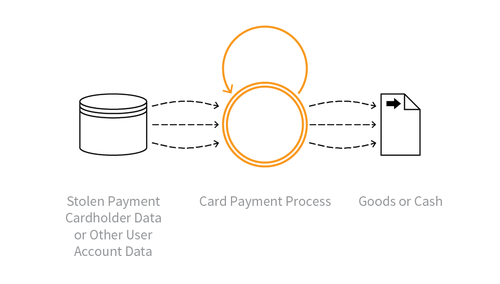

---

layout: col-sidebar
title: OAT-012 Cashing Out
site_side: false
tags: oatsEN
project: true

---

**現金引き出し (Cashing Out)** は自動化された脅威です。 OWASP Automated Threat Handbook - Web Applications ([pdf](https://github.com/OWASP/www-project-automated-threats-to-web-applications/tree/master/assets/files/EN), [印刷物](http://www.lulu.com/shop/owasp-foundation/automated-threat-handbook/paperback/product-23540699.html)) は [OWASP Automated Threats to Web Applications Project](../../../) の成果物であり、それぞれの脅威、検出方法、対策についてより詳しいガイドを提供します。 [脅威識別チャート](https://www.owasp.org/www-project-automated-threats-to-web-applications/assets/files/oat-ontology-decision-chart.pdf) は自動化された脅威を正しく識別するのに役立ちます。

## 定義
### OWASP Automated Threat (OAT) ID 番号
OAT-012

### 脅威イベント名
現金引き出し (Cashing Out)

### 特徴・特性の概要
検証済みの盗まれたペイメントカードやその他のユーザーアカウントデータを利用して、商品を購入したり、現金を取得したりします。

### イメージ図

### 解説
盗難に遭い、事前に検証済みのペイメントカードやその他のアカウントログイン認証情報を使用して、アプリケーションを介して通貨やより価値の高い商品を取得します。現金引き出しは商品返品詐欺と関連して行われることもあります。金融取引の場合、これは一般的に運び屋の口座への送金となります。ペイメントカードの場合、このアクティビティは大量に盗まれたデータの [OAT-001 カード試行 (Carding)](OAT-001_Carding.md) 、または [OAT-010 カードクラッキング (Card Cracking)](OAT-010_Card_Cracking.md) の後に行われることがあり、商品は再発送者の住所に降ろされます。金融以外のアプリケーションでの支払いの払い戻し (税金の還付、保険金の支払いなど) も現金引き出しに含まれます。

アプリケーションから他の価値のある情報を取得することは [OAT-011 スクレイピング (Scraping)](OAT-011_Scraping.html) になります。

### 他の名称や事例

### 関連項目
* [OAT-001 カード試行 (Carding)](OAT-001_Carding.md)
* [OAT-010 カードクラッキング (Card Cracking)](OAT-010_Card_Cracking.md)
* [OAT-011 スクレイピング (Scraping)](OAT-011_Scraping.md)

## クロスリファレンス
### CAPEC Category / Attack Pattern IDs
* 210 Abuse of Functionality

### CWE Base / Class / Variant IDs
* 799 Improper Control of Interaction Frequency
* 837 Improper Enforcement of a Single, Unique Action

### WASC Threat IDs
* 21 Insufficient Anti-Automation
* 42 Abuse of Functionality

### OWASP Attack Category / Attack IDs
* Abuse of Functionality

  [OWASP ウェブアプリケーションに対する自動化された脅威プロジェクト](../../../) に戻る。  
