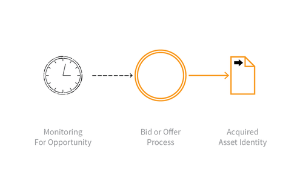

---

layout: col-sidebar
title: OAT-013 Sniping
site_side: false
tags: oatsJA
project: true

---

**狙撃 (Sniping)** は自動化された脅威です。 OWASP Automated Threat Handbook - Web Applications ([pdf](https://github.com/OWASP/www-project-automated-threats-to-web-applications/tree/master/assets/files/EN), [印刷物](http://www.lulu.com/shop/owasp-foundation/automated-threat-handbook/paperback/product-23540699.html)) は [OWASP Automated Threats to Web Applications Project](../../../) の成果物であり、それぞれの脅威、検出方法、対策についてより詳しいガイドを提供します。 [脅威識別チャート](https://www.owasp.org/www-project-automated-threats-to-web-applications/assets/files/oat-ontology-decision-chart.pdf) は自動化された脅威を正しく識別するのに役立ちます。

## 定義
### OWASP Automated Threat (OAT) ID 番号
OAT-013

### 脅威イベント名
狙撃 (Sniping)

### 特徴・特性の概要
商品やサービスに対して直前に入札やオファーをします。

### イメージ図

### 解説
狙撃の明らかな特徴は、特定の目的を達成するために、他のユーザーが入札やオファーをするのに十分な時間を残さないように、最後の機会に行われるアクションです。狙撃はタイミング攻撃という形でシステム遅延を自動的に悪用することもできます。慎重なタイミングと迅速なアクションが必要となります。オークションスナイピングとしてもっともよく知られていますが、同じ脅威イベントが他の種類のアプリケーションに使用されることがあります。通常、狙撃は他のユーザーに何らかの不利益をもたらし、時にはサービス拒否の一形態とみなされることもありえます。

これに対して [OAT-005 スキャルピング (Scalping)](OAT-005_Scalping.md) は人気のある商品やサービスの入手困難性の獲得であり、 [OAT-006 高速化 (Expediting)](OAT-006_Expediting.html) は一般的な進行を速めるものです。

### 他の名称や事例
オークションスナイピング (Auction sniping); 入札スナイパー (Bid sniper); フロントランニング (Front- running); ラストルック (Last look); 直前入札 (Last minute bet); タイミング攻撃 (Timing attack)

### 関連項目
* [OAT-005 スキャルピング (Scalping)](OAT-005_Scalping.md)
* [OAT-006 高速化 (Expediting)](OAT-006_Expediting.md)
* [OAT-015 サービス拒否 (Denial of Service)](OAT-015_Denial_of_Service.md)
* [OAT-021 在庫拒否 (Denial of Inventory)](OAT-021_Denial_of_Inventory.md)

## クロスリファレンス
### CAPEC Category / Attack Pattern IDs
* 210 Abuse of Functionality

### CWE Base / Class / Variant IDs
* -

### WASC Threat IDs
* 21 Insufficient Anti-Automation
* 42 Abuse of Functionality

### OWASP Attack Category / Attack IDs
* Abuse of Functionality

  [OWASP ウェブアプリケーションに対する自動化された脅威プロジェクト](../../../) に戻る。  
