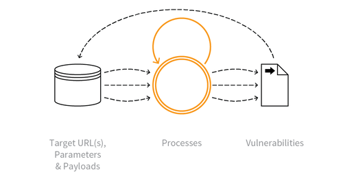

---

layout: col-sidebar
title: OAT-014 Vulnerability Scanning
site_side: false
tags: oatsJA
project: true

---

**脆弱性スキャン (Vulnerability Scanning)** は自動化された脅威です。 OWASP Automated Threat Handbook - Web Applications ([pdf](https://github.com/OWASP/www-project-automated-threats-to-web-applications/tree/master/assets/files/EN), [印刷物](http://www.lulu.com/shop/owasp-foundation/automated-threat-handbook/paperback/product-23540699.html)) は [OWASP Automated Threats to Web Applications Project](../../../) の成果物であり、それぞれの脅威、検出方法、対策についてより詳しいガイドを提供します。 [脅威識別チャート](https://www.owasp.org/www-project-automated-threats-to-web-applications/assets/files/oat-ontology-decision-chart.pdf) は自動化された脅威を正しく識別するのに役立ちます。

## 定義
### OWASP Automated Threat (OAT) ID 番号
OAT-014

### 脅威イベント名
脆弱性スキャン (Vulnerability Scanning)

### 特徴・特性の概要
アプリケーションをクロールおよびファジングして、弱点や潜在的な脆弱性を特定します。

### イメージ図

### 解説
識別可能、推測可能、および不明なコンテンツの場所、パス、ファイル名、パラメータを体系的に列挙して調査し、セキュリティ脆弱性が存在する可能性がある箇所や弱点を見つけます。脆弱性スキャンには悪意のあるスキャンと、許可された脆弱性スキャンエンジンによる友好的なスキャンの両方を含みます。 [OAT-011 スクレイピング (Scraping)](OAT-011_Scraping.md) とは異なり、潜在的な脆弱性を特定することを目的としています。

個々の脆弱性の悪用についてはこのオントロジーのスコープには含まれていませんが、このスキャンのプロセスは [OAT-018 足跡採取 (Footprinting)](OAT-018_Footprinting.md), [OAT-004 指紋採取 (Fingerprinting)](OAT-004_Fingerprinting.md), [OAT-011 スクレイピング (Scraping)](OAT-011_Scraping.md) とともにアプリケーションペネトレーションテストの一部を形成することがよくあります。

### 他の名称や事例
アクティブ/パッシブスキャン (Active/Passive scanning); アプリケーション固有の脆弱性発見 (Application-specific vulnerability discovery); 脆弱なコンテンツ管理システム (CMS) および CMS コンポーネントの特定 (Identifying vulnerable content management systems (CMS) and CMS components); 既知の脆弱性スキャン (Known vulnerability scanning); 悪意のあるクロール (Malicious crawling); 脆弱性偵察 (Vulnerability reconnaissance)

### 関連項目
* [OAT-004 指紋採取 (Fingerprinting)](OAT-004_Fingerprinting.md)
* [OAT-011 スクレイピング (Scraping)](OAT-011_Scraping.md)
* [OAT-018 足跡採取 (Footprinting)](OAT-018_Footprinting.md)

## クロスリファレンス
### CAPEC Category / Attack Pattern IDs
* -

### CWE Base / Class / Variant IDs
* 799 Improper Control of Interaction Frequency

### WASC Threat IDs
* 21 Insufficient Anti-Automation

### OWASP Attack Category / Attack IDs
* -

  [OWASP ウェブアプリケーションに対する自動化された脅威プロジェクト](../../../) に戻る。  
