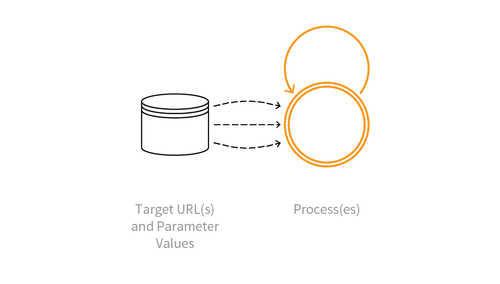

---

layout: col-sidebar
title: OAT-015 Denial of Service
site_side: false
tags: oatsJA
project: true

---

**サービス拒否 (Denial of Service)** は自動化された脅威です。 OWASP Automated Threat Handbook - Web Applications ([pdf](https://github.com/OWASP/www-project-automated-threats-to-web-applications/tree/master/assets/files/EN), [印刷物](http://www.lulu.com/shop/owasp-foundation/automated-threat-handbook/paperback/product-23540699.html)) は [OWASP Automated Threats to Web Applications Project](../../../) の成果物であり、それぞれの脅威、検出方法、対策についてより詳しいガイドを提供します。 [脅威識別チャート](https://www.owasp.org/www-project-automated-threats-to-web-applications/assets/files/oat-ontology-decision-chart.pdf) は自動化された脅威を正しく識別するのに役立ちます。

## 定義
### OWASP Automated Threat (OAT) ID 番号
OAT-015

### 脅威イベント名
サービス拒否 (Denial of Service)

### 特徴・特性の概要
アプリケーションサーバー、データベースサーバー、個々のユーザーアカウントをターゲットにして、サービス拒否 (DoS) を実現します。

### イメージ図

### 解説
使い方はアプリケーションの正規の使い方と似ているかもしれませんが、ファイルシステム、メモリ、プロセス、スレッド、CPU、人的リソース、金銭的リソースの枯渇につながります。リソースはウェブサーバー、アプリケーションサーバー、データベースサーバー、アプリケーションをサポートするサードパーティ API などのその他のサービス、サードパーティがホストするコンテンツ、コンテンツ配信ネットワーク (CDN) に関連している可能性があります。アプリケーション全体が影響を受ける可能性もあれば、アカウントロックアウトなどの個々のユーザーに対する攻撃の可能性もあります。

このオントロジーのスコープとしてはウェブアプリケーションに影響を与える他の形態のサービス拒否、すなわち HTTP Flood DoS (GET, POST, Header with/without TLS), HTTP Slow DoS, IP layer 3 DoS, TCP layer 4 DoS を除外しています。これらのプロトコルや低レイヤの側面では他の分類法やリストで十分にカバーされています。

### 他の名称や事例
アカウントロックアウト (Account lockout); アプリレイヤ DDoS (App layer DDoS); 非対称リソース消費 (増幅) (Asymmetric resource consumption (amplification)); ビジネスロジック DDoS (Business logic DDoS); 現金オーバーフロー (Cash overflow); 強制デッドロック (Forced deadlock); ハッシュ DoS (Hash DoS); 非効率なコード (Inefficient code); インデクサ DoS (Indexer DoS); 大容量ファイル DoS (Large files DoS); リソース枯渇 (Resource depletion, locking or exhaustion); 持続的クライアントエンゲージメント (Sustained client engagement)

### 関連項目
* [OAT-005 スキャルピング (Scalping)](OAT-005_Scalping.md)
* [OAT-013 狙撃 (Sniping)](OAT-013_Sniping.md)
* [OAT-017 スパム行為 (Spamming)](OAT-017_Spamming.md)
* [OAT-019 アカウント作成 (Account Creation)](OAT-019_Account_Creation.md)
* [OAT-021 在庫拒否 (Denial of Inventory)](OAT-021_Denial_of_Inventory.md)

## クロスリファレンス
### CAPEC Category / Attack Pattern IDs
* 2 Inducing Account Lockout
* 25 Forced Deadlock
* 119 Deplete Resources

### CWE Base / Class / Variant IDs
* 399 Resource Management Errors
* 645 Overly Restrictive Account Lockout Mechanism

### WASC Threat IDs
* 10 Denial of Service

### OWASP Attack Category / Attack IDs
* Account Lockout Attack
* Cash Overflow
* Denial of Service
* Resource Depletion

  [OWASP ウェブアプリケーションに対する自動化された脅威プロジェクト](../../../) に戻る。  
