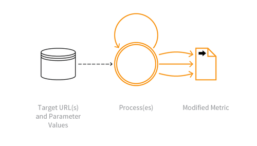

---

layout: col-sidebar
title: OAT-016 Skewing
site_side: false
tags: oatsJA
project: true

---

**スキューイング (Skewing)** は自動化された脅威です。 OWASP Automated Threat Handbook - Web Applications ([pdf](https://github.com/OWASP/www-project-automated-threats-to-web-applications/tree/master/assets/files/EN), [印刷物](http://www.lulu.com/shop/owasp-foundation/automated-threat-handbook/paperback/product-23540699.html)) は [OWASP Automated Threats to Web Applications Project](../../../) の成果物であり、それぞれの脅威、検出方法、対策についてより詳しいガイドを提供します。 [脅威識別チャート](https://www.owasp.org/www-project-automated-threats-to-web-applications/assets/files/oat-ontology-decision-chart.pdf) は自動化された脅威を正しく識別するのに役立ちます。

## 定義
### OWASP Automated Threat (OAT) ID 番号
OAT-016

### 脅威イベント名
スキューイング (Skewing)

### 特徴・特性の概要
リンククリック、ページリクエスト、フォーム送信を繰り返して、なんらかのメトリクスを改変します。

### イメージ図

### 解説
クリックやリクエストやコンテンツ送信を自動的に繰り返して、頻度や割合のカウントや測定値などのアプリケーションベースのメトリクスを動かします。メトリクスや測定値はユーザーに見えるもの (入札オッズ、いいねの数、市場の動的価格、訪問者数、投票結果、レビューなど) もありますし、見えないもの (アプリケーション使用統計、ビジネス業績評価指標など) もあります。メトリクスはアプリケーション所有者だけでなく、個人にも影響を影響を与える可能性があります。たとえば、ユーザーの評判、他者への影響、名声の獲得、他者の評判を下げることなどがあります。

デジタル広告のメトリクスを悪意を持って改変する場合は、代わりに [OAT-003 広告偽装 (Ad Fraud)](OAT-003_Ad_Fraud.md) を参照してください。

### 他の名称や事例
KPI バイアス (Biasing KPIs); 友達、訪問者、いいねの増強 (Boosting friends, visitors, and likes); クリック偽装 (Click fraud); 動的価格ハッキング (Dynamic pricing hacking); 選挙偽装 (Election fraud); ヒットカウント偽装 (Hit count fraud); 市場の歪み (Market distortion); メトリクスと統計のスキューイング (Metric and statistic skewing); ページインプレッション偽装 (Page impression fraud); 投票偽装 (Poll fraud); 投票スキューイング (Poll skewing); 投票転覆 (Poll/voting subversion); レーティング/レビュースキューイング (Rating/review skewing); SEO; 株式操作 (Stock manipulation); 調査スキューイング (Survey skewing)

### 関連項目
* [OAT-003 広告偽装 (Ad Fraud)](OAT-003_Ad_Fraud.md)
* [OAT-017 スパム行為 (Spamming)](OAT-017_Spamming.md)
* [OAT-019 アカウント作成 (Account Creation)](OAT-019_Account_Creation.md)

## クロスリファレンス
### CAPEC Category / Attack Pattern IDs
* 210 Abuse of Functionality

### CWE Base / Class / Variant IDs
* 799 Improper Control of Interaction Frequency
* 837 Improper Enforcement of a Single, Unique Action

### WASC Threat IDs
* 21 Insufficient Anti-Automation
* 42 Abuse of Functionality

### OWASP Attack Category / Attack IDs
* Abuse of Functionality

  [OWASP ウェブアプリケーションに対する自動化された脅威プロジェクト](../../../) に戻る。  
