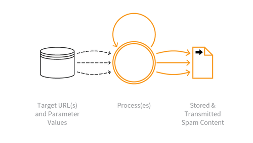

---

layout: col-sidebar
title: OAT-017 Spamming
site_side: false
tags: oatsJA
project: true

---

**スパム行為 (Spamming)** は自動化された脅威です。 OWASP Automated Threat Handbook - Web Applications ([pdf](https://github.com/OWASP/www-project-automated-threats-to-web-applications/tree/master/assets/files/EN), [印刷物](http://www.lulu.com/shop/owasp-foundation/automated-threat-handbook/paperback/product-23540699.html)) は [OWASP Automated Threats to Web Applications Project](../../../) の成果物であり、それぞれの脅威、検出方法、対策についてより詳しいガイドを提供します。 [脅威識別チャート](https://www.owasp.org/www-project-automated-threats-to-web-applications/assets/files/oat-ontology-decision-chart.pdf) は自動化された脅威を正しく識別するのに役立ちます。

## 定義
### OWASP Automated Threat (OAT) ID 番号
OAT-017

### 脅威イベント名
スパム行為 (Spamming)

### 特徴・特性の概要
悪意のある情報や疑わしい情報を付加して、公開または非公開のコンテンツ、データベース、ユーザーメッセージに表示します。

### イメージ図

### 解説
悪意のあるコンテンツにはマルウェア、IFRAME 配信、写真と動画、広告、リファラースパム、追跡/監視コードなどがあります。コンテンツにそれほど明確に悪意はなくても、いたずらを引き起こしたり、検索エンジン最適化 (SEO) を行ったり、他の投稿を目立たなくしたり隠したりする試みである可能性があります。

不具合のあるフォームから電子メール機能、不具合のあるフォームから SMS 機能を大規模に悪用して、意図しない受信者にメッセージを送信することは、実装上の欠陥のみを悪用したものとみなされるため、この脅威イベントやこのオントロジーの他のイベントには含まれません。

メトリクスを歪めるような複数の使用については、代わりに [OAT-016 スキューイング (Skewing)](OAT-016_Skewing.md) を参照してください。

### 他の名称や事例
ブログスパム (Blog spam); 掲示板スパム (Bulletin board spam); クリックベイト (Click-bait); コメントスパム (Comment spam); コンテンツスパム (Content spam); コンテンツのなりすまし (Content spoofing); フェイクニュース (Fake news); フォームスパム (Form spam); フォーラムスパム (Forum spam); ゲストブックスパム (Guestbook spam); リファラースパム (Referrer spam); レビュースパム (Review spam); SEO スパム (SEO spam); スパムクローラー (Spam crawlers); スパム 2.0 (Spam 2.0); スパムボット (Spambot); ツイッタースパム (Twitter spam); ウィキスパム (Wiki spam)

### 関連項目
* [OAT-015 サービス拒否 (Denial of Service)](OAT-015_Denial_of_Service.md)
* [OAT-016 スキューイング (Skewing)](OAT-016_Skewing.md)
* [OAT-019 アカウント作成 (Account Creation)](OAT-019_Account_Creation.md)

## クロスリファレンス
### CAPEC Category / Attack Pattern IDs
* 210 Abuse of Functionality

### CWE Base / Class / Variant IDs
* 506 Embedded Malicious Code
* 799 Improper Control of Interaction Frequency
* 837 Improper Enforcement of a Single, Unique Action

### WASC Threat IDs
* 21 Insufficient Anti-Automation
* 42 Abuse of Functionality

### OWASP Attack Category / Attack IDs
* Abuse of Functionality

  [OWASP ウェブアプリケーションに対する自動化された脅威プロジェクト](../../../) に戻る。  
