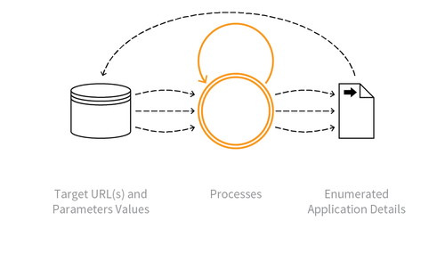

---

layout: col-sidebar
title: OAT-018 Footprinting
site_side: false
tags: oatsJA
project: true

---

**足跡採取 (Footprinting)** は自動化された脅威です。 OWASP Automated Threat Handbook - Web Applications ([pdf](https://github.com/OWASP/www-project-automated-threats-to-web-applications/tree/master/assets/files/EN), [印刷物](http://www.lulu.com/shop/owasp-foundation/automated-threat-handbook/paperback/product-23540699.html)) は [OWASP Automated Threats to Web Applications Project](../../../) の成果物であり、それぞれの脅威、検出方法、対策についてより詳しいガイドを提供します。 [脅威識別チャート](https://www.owasp.org/www-project-automated-threats-to-web-applications/assets/files/oat-ontology-decision-chart.pdf) は自動化された脅威を正しく識別するのに役立ちます。

## 定義
### OWASP Automated Threat (OAT) ID 番号
OAT-018

### 脅威イベント名
足跡採取 (Footprinting)

### 特徴・特性の概要
アプリケーションを調査および探索し、構成要素やプロパティを特定します。

### イメージ図

### 解説
アプリケーションの構成、設定、セキュリティメカニズムについて可能な限り学習することを目的として情報収集を行います。スクレイピングとは異なり、足跡採取はデータではなくアプリケーション自体を列挙します。これを使用して、すべての URL パス、パラメータと値、プロセスシーケンスを特定します (すなわち、エントリーポイント (攻撃対象領域とも総称される) を決定します) 。アプリケーションを探索すると、さらにパスが特定され、順に調査する必要があります。

足跡採取にはブルートフォース、辞書、ファイル名とディレクトリ名の推測も含むことがあります。ファジングを使用して、さらにアプリケーションリソースや機能を特定するかもしれません。しかし、弱点を悪用しようとする試みは含みません。

### 他の名称や事例
アプリケーション解析 (Application analysis); API 発見 (API discovery); アプリケーション列挙 (Application enumeration); 自動スキャン (Automated scanning); CGI スキャン (CGI scanning); クローラー (Crawler); クローリング (Crawling); 発掘 (Excavation); 強制ブラウジング (Forced browsing; Forceful browsing); ファジング (Fuzzing); マイクロサービス発見 (Micro service discovery); スキャン (Scanning); スパイダリング (Spidering); WSDL スキャン (WSDL scanning)

### 関連項目
* [OAT-004 指紋採取 (Fingerprinting)](OAT-004_Fingerprinting.md)
* [OAT-011 スクレイピング (Scraping)](OAT-011_Scraping.md)

## クロスリファレンス
### CAPEC Category / Attack Pattern IDs
* 169 Footprinting

### CWE Base / Class / Variant IDs
* 200 Information Exposure

### WASC Threat IDs
* 45 Fingerprinting

### OWASP Attack Category / Attack IDs
* -

  [OWASP ウェブアプリケーションに対する自動化された脅威プロジェクト](../../../) に戻る。  
