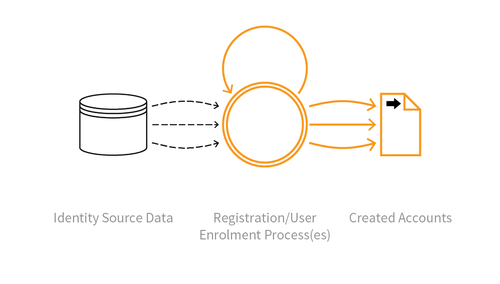

---

layout: col-sidebar
title: OAT-019 Account Creation
site_side: false
tags: oatsJA
project: true

---

**アカウント作成 (Account Creation)** は自動化された脅威です。 OWASP Automated Threat Handbook - Web Applications ([pdf](https://github.com/OWASP/www-project-automated-threats-to-web-applications/tree/master/assets/files/EN), [印刷物](http://www.lulu.com/shop/owasp-foundation/automated-threat-handbook/paperback/product-23540699.html)) は [OWASP Automated Threats to Web Applications Project](../../../) の成果物であり、それぞれの脅威、検出方法、対策についてより詳しいガイドを提供します。 [脅威識別チャート](https://www.owasp.org/www-project-automated-threats-to-web-applications/assets/files/oat-ontology-decision-chart.pdf) は自動化された脅威を正しく識別するのに役立ちます。

## 定義
### OWASP Automated Threat (OAT) ID 番号
OAT-019

### 脅威イベント名
アカウント作成 (Account Creation)

### 特徴・特性の概要
その後の不正使用のために複数のアカウントを作成します。

### イメージ図

### 解説
アプリケーションのアカウントサインアッププロセスを使用して、アカウントを大量作成し、時にはプロフィールを作成します。アカウントはその後、コンテンツスパムの生成、現金や商品のロンダリング、マルウェアの拡散、評判の悪化、いたずら、検索エンジン最適化 (SEO) のスキューイング、レビューのスキューイング、サーベイのスキューイングに悪用されます。

アカウント作成は新しいアカウントを生成します。既存のアカウントを使用する脅威イベントについては [OAT-007 認証情報クラッキング (Credential Cracking)](OAT-007_Credential_Cracking.md) と [OAT-008 認証情報スタッフィング (Credential Stuffing)](OAT-008_Credential_Stuffing.md) を参照してください。

### 他の名称や事例
アカウントファーミング (Account pharming); 偽アカウント (Fake account); 偽ソーシャルメディアアカウント作成 (Fake social media account creation); なりすましボット (Impersonator bot); 大量アカウント登録 (Massive account registration); 新規アカウント作成 (New account creation); 大量ユーザーアカウント登録 (Registering many user accounts)

### 関連項目
* [OAT-007 認証情報クラッキング (Credential Cracking)](OAT-007_Credential_Cracking.md)
* [OAT-008 認証情報スタッフィング (Credential Stuffing)](OAT-008_Credential_Stuffing.md)

## クロスリファレンス
### CAPEC Category / Attack Pattern IDs
* 210 Abuse of Functionality

### CWE Base / Class / Variant IDs
* 799 Improper Control of Interaction Frequency
* 837 Improper Enforcement of a Single, Unique Action
* 841 Improper Enforcement of Behavioral Workflow

### WASC Threat IDs
* 21 Insufficient Anti-Automation
* 42 Abuse of Functionality

### OWASP Attack Category / Attack IDs
* Abuse of Functionality

  [OWASP ウェブアプリケーションに対する自動化された脅威プロジェクト](../../../) に戻る。  
