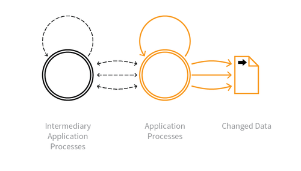

---

layout: col-sidebar
title: OAT-020 Account Aggregation
site_side: false
tags: oatsJA
project: true

---

**アカウント集約 (Account Aggregation)** は自動化された脅威です。 OWASP Automated Threat Handbook - Web Applications ([pdf](https://github.com/OWASP/www-project-automated-threats-to-web-applications/tree/master/assets/files/EN), [印刷物](http://www.lulu.com/shop/owasp-foundation/automated-threat-handbook/paperback/product-23540699.html)) は [OWASP Automated Threats to Web Applications Project](../../../) の成果物であり、それぞれの脅威、検出方法、対策についてより詳しいガイドを提供します。 [脅威識別チャート](https://www.owasp.org/www-project-automated-threats-to-web-applications/assets/files/oat-ontology-decision-chart.pdf) は自動化された脅威を正しく識別するのに役立ちます。

## 定義
### OWASP Automated Threat (OAT) ID 番号
OAT-020

### 脅威イベント名
アカウント集約 (Account Aggregation)

### 特徴・特性の概要
複数のアカウントをまとめて、それらに代わってやり取りする仲介アプリケーションで使用します。

### イメージ図

### 解説
複数のアプリケーションアカウントから別のシステムへの認証情報と情報を編集します。この集約アプリケーションは単一ユーザーについて複数アプリケーションの情報を統合するために使用することも、あるいは単一アプリケーションの多数のユーザーの情報を統合するために使用することもあります。一般に、ソーシャルメディアアカウント、電子メールアカウント、金融アカウントを集約して、統合された概要を取得し、統合されたレポートと分析を提供し、ユーザーや専門アドバイザーによる使用や消費を簡素化するために使用されます。アカウントプロパティの変更や集約されたアプリケーションの機能とやり取りが含まれることもあります。

コンテンツの配布など他の形式のデータ収集については [OAT-011 スクレイピング (Scraping)](OAT-011_Scraping.md) を参照してください。進行を速めるには、代わりに [OAT-006 高速化 (Expediting)](OAT-006_Expediting.md) を参照してください。

### 他の名称や事例
アグリゲーター (Aggregator); 仲介 (Brokering); クライアントアグリゲーター (Client aggregator); クラウドサービス仲介 (Cloud services brokerage); データ集約 (Data aggregation); 金融アカウントアグリゲーター (Financial account aggregator); 仲介 (Intermediarisation; Intermediation)

### 関連項目
* [OAT-006 高速化 (Expediting)](OAT-006_Expediting.md)
* [OAT-011 スクレイピング (Scraping)](OAT-011_Scraping.md)
* [OAT-019 アカウント作成 (Account Creation)](OAT-019_Account_Creation.md)

## クロスリファレンス
### CAPEC Category / Attack Pattern IDs
* 167 Lifting Sensitive Data from the Client
* 210 Abuse of Functionality

### CWE Base / Class / Variant IDs
* 799 Improper Control of Interaction Frequency

### WASC Threat IDs
* 21 Insufficient Anti-Automation
* 42 Abuse of Functionality

### OWASP Attack Category / Attack IDs
* Abuse of Functionality

  [OWASP ウェブアプリケーションに対する自動化された脅威プロジェクト](../../../) に戻る。  
