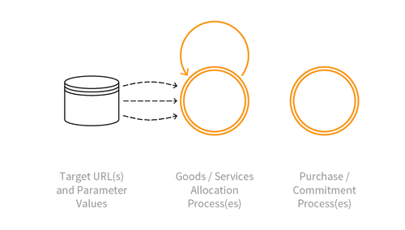

---

layout: col-sidebar
title: OAT-021 Denial of Inventory
site_side: false
tags: oatsJA
project: true

---

**在庫拒否 (Denial of Inventory)** は自動化された脅威です。 OWASP Automated Threat Handbook - Web Applications ([pdf](https://github.com/OWASP/www-project-automated-threats-to-web-applications/tree/master/assets/files/EN), [印刷物](http://www.lulu.com/shop/owasp-foundation/automated-threat-handbook/paperback/product-23540699.html)) は [OWASP Automated Threats to Web Applications Project](../../../) の成果物であり、それぞれの脅威、検出方法、対策についてより詳しいガイドを提供します。 [脅威識別チャート](https://www.owasp.org/www-project-automated-threats-to-web-applications/assets/files/oat-ontology-decision-chart.pdf) は自動化された脅威を正しく識別するのに役立ちます。

## 定義
### OWASP Automated Threat (OAT) ID 番号
OAT-021

### 脅威イベント名
在庫拒否 (Denial of Inventory)

### 特徴・特性の概要
購入を完了することなく、または取引をコミットすることなく、商品やサービスの在庫を使い果たします。

### イメージ図

### 解説
限られた在庫の中からアイテムを選択して保持しまするが、実際には購入、支払い、確認することがないため、他のユーザーがそのアイテムを購入/支払い/確認することはできません。 [OAT-005 スキャルピング (Scalping)](OAT-005_Scalping.md) とは異なり、攻撃者が商品やサービスを実際に取得することはありません。

在庫拒否は E コマースアイテムをカート/バスケットに多数追加することで流通を停止させると考えるのが最も一般的です。攻撃者が実際に商品をチェックアウトして購入することはありませんが、在庫切れ状態となる可能性を助長します。この自動化された脅威イベントのバリエーションとして予約 (ホテルの部屋、レストランのテーブル、休日の予約、飛行機の座席など) や支払いなしのクリックアンドコレクトがあります。ただし、この利用可能な在庫の枯渇はサービス割り当て、製品配給、利用可能な時間枠、キューの位置、予算配分などの商品以外の割り当てなどの他のタイプのウェブアプリケーションでも発生します。

サーバーリソースを減少する場合は、代わりに [OAT-015 サービス拒否 (Denial of Service)](OAT-015_Denial_of_Service.md) を参照してください。 [OAT-005 スキャルピング (Scalping)](OAT-005_Scalping.md)、在庫拒否は商品やサービスの入手可能性を低下します。

### 他の名称や事例
買い溜め (Hoarding); 全保持攻撃 (Hold all attack); 在庫切れ (Inventory depletion; Inventory exhaustion; Stock exhaustion)

### 関連項目
* [OAT-005 スキャルピング (Scalping)](OAT-005_Scalping.md)
* [OAT-013 狙撃 (Sniping)](OAT-013_Sniping.md)
* [OAT-015 サービス拒否 (Denial of Service)](OAT-015_Denial_of_Service.md)

## クロスリファレンス
### CAPEC Category / Attack Pattern IDs
* 210 Abuse of Functionality

### CWE Base / Class / Variant IDs
* 799 Improper Control of Interaction Frequency
* 841 Improper Enforcement of Behavioral Workflow

### WASC Threat IDs
* 21 Insufficient Anti-Automation
* 42 Abuse of Functionality

### OWASP Attack Category / Attack IDs
* Abuse of Functionality

  [OWASP ウェブアプリケーションに対する自動化された脅威プロジェクト](../../../) に戻る。  
