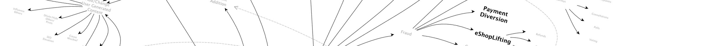

---

layout: col-sidebar
title: OWASP Automated Threats to Web Applications
site_side: true
tags: oat
project: true
level: 3
type: documentation

---

OWASP ウェブアプリケーションに対する自動化された脅威プロジェクトはレポート、学術論文、その他の論文、ニュース記事、脆弱性分類法/リストのレビューを完了し、これらのシナリオを特定、命名、分類しました。ソフトウェアによって自動化され、許容された動作からの逸脱を引き起こし、ウェブアプリケーションに一つ以上の望ましくない影響をもたらしますが、単一問題の脆弱性をツールベースで悪用することは除外しています。当初の目的は開発者、アーキテクト、オペレーター、ビジネスオーナー、セキュリティエンジニア、購買担当者、サプライヤー/ベンダーに共通の言語を提供するオントロジーを作成して、明確なコミュニケーションを促進し、問題解決に貢献することでした。また、このプロジェクトではこの問題領域の症状、緩和策、管理策も特定しています。すべての OWASP の成果物と同様に、すべてがフリーで、オープンソースライセンスを使用して公開されています。

## 説明

ウェブアプリケーションは毎日のように望まれない自動化された使用にされされています。多くの場合、これらのイベントは未対応の脆弱性を悪用しようとするものではなく、本来の有効な機能の不正使用に関連しています。また、過度の不正使用は一般的に HTTP フラッディングのようなアプリケーションサービス拒否 (DoS) として誤って報告されがちですが、実際には DoS が主目的はなく副次的な影響です。多くの場合、これらには分野固有の名称がついています。ウェブアプリケーションのオーナーが定期的に見かけるこれらの問題のほとんどは OWASP Top Ten や他の上位問題リストには掲載されません。さらに、これらは既存の辞書に適切に列挙されることも定義されることもありません。これらの要因により可視性が不十分であり、そのような脅威の命名に一貫性がなく、その結果、問題に対処する試みが明確ではなくなっています。

開発者、オペレーター、アーキテクト、ビジネスオーナー、セキュリティエンジニア、購買担当者、サプライヤー/ベンダーの間で共通の言語を共有しなければ、誰もが明確にコミュニケーションをとるために余計な努力をしなければなりません。
誤解は高くつくかもしれません。その悪影響はアプリケーションや関連するシステムコンポーネントのセキュリティだけでなく、個人のプライバシーやセキュリティにも及びます。

## 自動化された脅威

脅威イベントのリストは [OWASP Automated Threat Handbook](https://github.com/OWASP/www-project-automated-threats-to-web-applications/tree/master/assets/files/EN) でより詳細に定義されており、アルファベット順になっています。

* [OAT-020 アカウント集約 (Account Aggregation)](assets/oats/JA/OAT-020_Account_Aggregation.md)
* [OAT-019 アカウント作成 (Account Creation)](assets/oats/JA/OAT-019_Account_Creation.md)
* [OAT-003 広告偽装 (Ad Fraud)](assets/oats/JA/OAT-003_Ad_Fraud.md)
* [OAT-009 CAPTCHA 破り (CAPTCHA Defeat)](assets/oats/JA/OAT-009_CAPTCHA_Defeat.md)
* [OAT-010 カードクラッキング (Card Cracking)](assets/oats/JA/OAT-010_Card_Cracking.md)
* [OAT-001 カード試行 (Carding)](assets/oats/JA/OAT-001_Carding.md)
* [OAT-012 現金引き出し (Cashing Out)](assets/oats/JA/OAT-012_Cashing_Out.md)
* [OAT-007 認証情報クラッキング (Credential Cracking)](assets/oats/JA/OAT-007_Credential_Cracking.md)
* [OAT-008 認証情報スタッフィング (Credential Stuffing)](assets/oats/JA/OAT-008_Credential_Stuffing.md)
* [OAT-021 在庫拒否 (Denial of Inventory)](assets/oats/JA/OAT-021_Denial_of_Inventory.md)
* [OAT-015 サービス拒否 (Denial of Service)](assets/oats/JA/OAT-015_Denial_of_Service.md)
* [OAT-006 高速化 (Expediting)](assets/oats/JA/OAT-006_Expediting.md)
* [OAT-004 指紋採取 (Fingerprinting)](assets/oats/JA/OAT-004_Fingerprinting.md)
* [OAT-018 足跡採取 (Footprinting)](assets/oats/JA/OAT-018_Footprinting.md)
* [OAT-005 スキャルピング (Scalping)](assets/oats/JA/OAT-005_Scalping.md)
* [OAT-011 スクレイピング (Scraping)](assets/oats/JA/OAT-011_Scraping.md)
* [OAT-016 スキューイング (Skewing)](assets/oats/JA/OAT-016_Skewing.md)
* [OAT-013 狙撃 (Sniping)](assets/oats/JA/OAT-013_Sniping.md)
* [OAT-017 スパム行為 (Spamming)](assets/oats/JA/OAT-017_Spamming.md)
* [OAT-002 トークンクラッキング (Token Cracking)](assets/oats/JA/OAT-002_Token_Cracking.md)
* [OAT-014 脆弱性スキャン (Vulnerability Scanning)](assets/oats/JA/OAT-014_Vulnerability_Scanning.md)

どれがどれかわからない？ [脅威識別チャート](assets/files/oat-ontology-decision-chart.pdf) と [ハンドブック全体](https://github.com/OWASP/www-project-automated-threats-to-web-applications/tree/master/assets/files/EN) を併用してください。

## ライセンス

すべての素材は自由に使用できます。これらは [Creative Commons Attribution-ShareAlike 3.0 license](http://creativecommons.org/licenses/by-sa/3.0/) の下でライセンスされていますので、あなたはこの著作物を複製、配布、送信できますし、翻案や商業的な使用が可能ですが、すべて帰属表示が必要です。この著作物を変更、変形、構築する場合、結果として得られる著作物はこの著作物と同じまたは類似のライセンスの下でのみ配布可能です。

© OWASP Foundation
