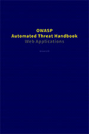
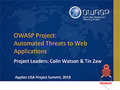

### クイックリンク
* [フリーハンドブックを PDF でダウンロードする](https://github.com/OWASP/www-project-automated-threats-to-web-applications/tree/master/assets/files/EN)

### これは何ですか？
* ウェブアプリケーションのオーナーが自動化された脅威から防御するのに役立つ情報とリソースです

### それではないですか？
* 別の脆弱性リストではありません
* OWASP Top N リストではありません
* 脅威モデリングではありません
* アタックツリーではありません
* ウェブ以外ではありません
* アプリケーション以外ではありません

### プロジェクトの目的

このプロジェクトはウェブアプリケーションに対する実世界の自動化された攻撃の調査と分析をまとめて、ドキュメントを作成し、オペレーターがこれらの脅威から防御することを支援することです。分野固有のガイダンスが利用できるでしょう。

### プロジェクト情報

* <i class="fas fa-flask" style="font-size: 1.2em; color:#FFA500;"></i>Lab Project
* <i class="fas fa-book" style="font-size: 1.2em; color:#233e81;"></i>Documentation
* <i class="fas fa-tools" style="font-size: 1.2em; color:#233e81;"></i>Builder 
* <i class="fas fa-shield-alt" style="font-size: 1.2em; color:#233e81;"></i>Defender

### プレゼンテーション
* 

### ライセンス

* 
