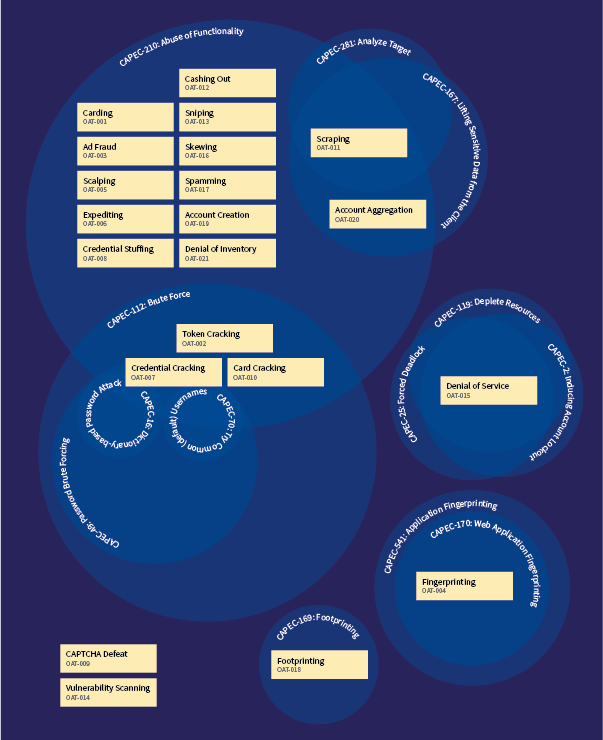
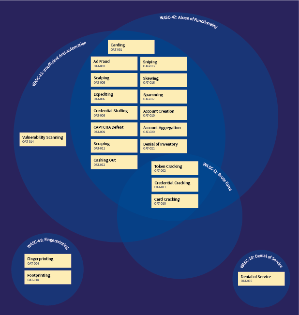

## オントロジー

### 序説

[OWASP Automated Threat Handbook](https://github.com/OWASP/www-project-automated-threats-to-web-applications/tree/master/assets/files/EN) で詳細に定義されている自動化された脅威イベントと概要説明の A-Z リストは以下のとおりです。

識別番号 | OAT 名称 | 特徴・特性の概要
---------|----------|-----------------------------------
[OAT-020](assets/oats/JA/OAT-020_Account_Aggregation.md) | アカウント集約 (Account Aggregation) | 複数のアカウントをまとめて、それらに代わってやり取りする仲介アプリケーションで使用します
[OAT-019](assets/oats/JA/OAT-019_Account_Creation.md) | アカウント作成 (Account Creation) | その後の不正使用のために複数のアカウントを作成します
[OAT-003](assets/oats/JA/OAT-003_Ad_Fraud.md) | 広告偽装 (Ad Fraud) | ウェブ掲載広告の偽装クリックや偽装表示です
[OAT-009](assets/oats/JA/OAT-009_CAPTCHA_Defeat.md) | CAPTCHA 破り (CAPTCHA Defeat) | 自動化防止テストを解決します
[OAT-010](assets/oats/JA/OAT-010_Card_Cracking.md) | カードクラッキング (Card Cracking) | 盗まれたペイメントカードのデータに欠落している開始日/有効期限やセキュリティコードをさまざまな値を試して特定します
[OAT-001](assets/oats/JA/OAT-001_Carding.md) | カード試行 (Carding) | 複数回の支払い承認を試行して、盗まれた大量のペイメントカードデータの有効性を検証します
[OAT-012](assets/oats/JA/OAT-012_Cashing_Out.md) | 現金引き出し (Cashing Out) | 検証済みの盗まれたペイメントカードやその他のユーザーアカウントデータを利用して、商品を購入したり、現金を取得したりします
[OAT-007](assets/oats/JA/OAT-007_Credential_Cracking.md) | 認証情報クラッキング (Credential Cracking) | ユーザー名やパスワードにさまざまな値を試すことで、有効なログイン認証情報を特定します
[OAT-008](assets/oats/JA/OAT-008_Credential_Stuffing.md) | 認証情報スタッフィング (Credential Stuffing) | 大量のログインを試行して、盗まれたユーザー名とパスワードのペアの有効性を検証します
[OAT-021](assets/oats/JA/OAT-021_Denial_of_Inventory.md) | 在庫拒否 (Denial of Inventory) | 購入を完了することなく、または取引をコミットすることなく、商品やサービスの在庫を使い果たします
[OAT-015](assets/oats/JA/OAT-015_Denial_of_Service.md) | サービス拒否 (Denial of Service) | アプリケーションサーバー、データベースサーバー、個々のユーザーアカウントをターゲットにして、サービス拒否 (DoS) を実現します
[OAT-006](assets/oats/JA/OAT-006_Expediting.md) | 高速化 (Expediting) | 一般的に遅く、退屈で、時間のかかるアクションの進行を速めるアクションを実行します
[OAT-004](assets/oats/JA/OAT-004_Fingerprinting.md) | 指紋採取 (Fingerprinting) | サポートしているソフトウェアとフレームワークのタイプとバージョンに関する情報を引き出します
[OAT-018](assets/oats/JA/OAT-018_Footprinting.md) | 足跡採取 (Footprinting) | アプリケーションを調査および探索し、構成要素やプロパティを特定します
[OAT-005](assets/oats/JA/OAT-005_Scalping.md) | スキャルピング (Scalping) | 入手が困難であったり優先的である商品やサービスを不当な手段で取得します
[OAT-011](assets/oats/JA/OAT-011_Scraping.md) | スクレイピング (Scraping) | アプリケーションのコンテンツやその他のデータを他の場所で使用するために収集します
[OAT-016](assets/oats/JA/OAT-016_Skewing.md) | スキューイング (Skewing) | リンククリック、ページリクエスト、フォーム送信を繰り返して、なんらかのメトリクスを改変します
[OAT-013](assets/oats/JA/OAT-013_Sniping.md) | 狙撃 (Sniping) | 商品やサービスに対して直前に入札やオファーをします
[OAT-017](assets/oats/JA/OAT-017_Spamming.md) | スパム行為 (Spamming) | 悪意のある情報や疑わしい情報を付加して、公開または非公開のコンテンツ、データベース、ユーザーメッセージに表示します
[OAT-002](assets/oats/JA/OAT-002_Token_Cracking.md) | トークンクラッキング (Token Cracking) | クーポン番号、バウチャーコード、割引トークンなどを大量列挙します
[OAT-014](assets/oats/JA/OAT-014_Vulnerability_Scanning.md) | 脆弱性スキャン (Vulnerability Scanning) | アプリケーションをクロールおよびファジングして、弱点や潜在的な脆弱性を特定します
&nbsp;&nbsp;&nbsp;&nbsp;&nbsp;&nbsp;&nbsp; | &nbsp; | &nbsp;

### 他の辞書、分類法、リストとの比較

#### [一般的な攻撃パターンの列挙と分類 (Common Attack Pattern Enumeration and Classification)](https://capec.mitre.org/) (CAPEC)

CAPEC はソフトウェアに対する既知の攻撃の辞書およびクラス分類法です。その主なクラス構造は以下のとおりです。

* [攻撃のドメイン](https://capec.mitre.org/data/definitions/3000.html) (3000) - ソーシャルエンジニアリング (403), [サプライチェーン](https://capec.mitre.org/data/definitions/437.html) (437), 通信 (512), [ソフトウェア](https://capec.mitre.org/data/definitions/513.html) (513), 物理的セキュリティ (514), ハードウェア (515)
* 攻撃のメカニズム (1000) - 情報収集 (118), リソース枯渇 (119), インジェクション (152), 詐欺的やり取り (156), タイミングと状態の操作 (172), 機能の悪用 (210), 確率的技法 (223), 認証の悪用 (225), 認可の悪用 (232), データ構造の操作 (255), リソース操作 (262), ターゲット分析 (281), 物理アクセスの取得 (436), 悪意のあるコード実行 (525), システムコンポーネントの改変 (526), システムユーザーの操作 (527)

#### [WASC 脅威分類 (WASC Threat Classification)](http://projects.webappsec.org/w/page/13246978/Threat%20Classification)

WASC 脅威分類はウェブサイト、そのデータ、そのユーザーの侵害につながる可能性のある脆弱性や攻撃を分類しています。

#### [OWASP WASC ウェブハッキングインシデントデータベースプロジェクト (OWASP WASC Web Hacking Incidents Database Project)](https://wiki.owasp.org/index.php/OWASP_WASC_Web_Hacking_Incidents_Database_Project) (WHID)

WHID は以下を使用して公に知られているインシデントを分類しています。

* 攻撃手法 例: ARP スプーフィング, 機能の悪用, アカウント侵害, 管理エラー, 自動化, バックドア, バンキングトロイの木馬, ブルートフォース, クリックジャッキング, コードインジェクション, コンテンツインジェクション, コンテンツスプーフィング, クレデンシャル/セッション予測, クロスサイトリクエストフォージェリ (CSRF), クロスサイトスクリプティング (XSS), サービス拒否, ディレクトリトラバーサル, ドメインハイジャック, DNS ハイジャック, 強制ブラウジング, HTTP レスポンス分割, 隠しパラメータ操作, 悪意のあるコードのホスティング, 情報漏洩, 不十分な認証, 既知の脆弱性, ローカルファイルインクルージョン (LFI), マルバタイジング, マルウェア, マルウェアインジェクション, 大量割り当て, 設定ミス, OS コマンド実行, パラメータ操作, パストラバーサル, フィッシング, 予測可能なリソースの場所, プロセス自動化, リダイレクト, リモートファイルインクルージョン (RFI), 不正なサードパーティアプリ, スケーピング, 検索エンジンポイズニング, シェルインジェクション, ソーシャルエンジニアリング, 盗まれたクレデンシャル, SQL インジェクション, 意図しない情報流出, 脆弱なパスワード回復検証, ワーム
* 脆弱性 例: 機能の悪用, アプリケーションの設定ミス, ディレクトリインデクシング, 不適切なファイルシステムパーミッション, 不適切な入力処理, 不適切な出力処理, 情報漏洩, セキュアではないインデクシング, 不十分な自動化防御, 不十分な認証, 不十分な認可, 不十分なエントロピー, 不十分なパスワード回復, 不十分なプロセス検証, 不十分なセッション有効期限, 不十分なトランスポート層保護, 設定ミス, 予測可能なリソースの場所, 脆弱なパスワード
* 結果 例: アカウントのハイジャック, アカウントの乗っ取り, ボットネットへの加担, 混乱, クレジットカードの漏洩, データ喪失, 改竄, DDoS 攻撃, DNS ハイジャック, DNS リダイレクション, 偽情報, 流出のみ, ダウンタイム, 恐喝, 詐欺, 情報戦, 情報漏洩, リンクスパム, 売り上げの損失, マルウェアのばらまき, 金銭的損失, フィッシング, マルウェアの仕込み, サービスの中断, セッションハイジャック, スパム, スパムリンク, 盗まれたクレデンシャル, ワーム
プラス その他/いろいろ/不明。
